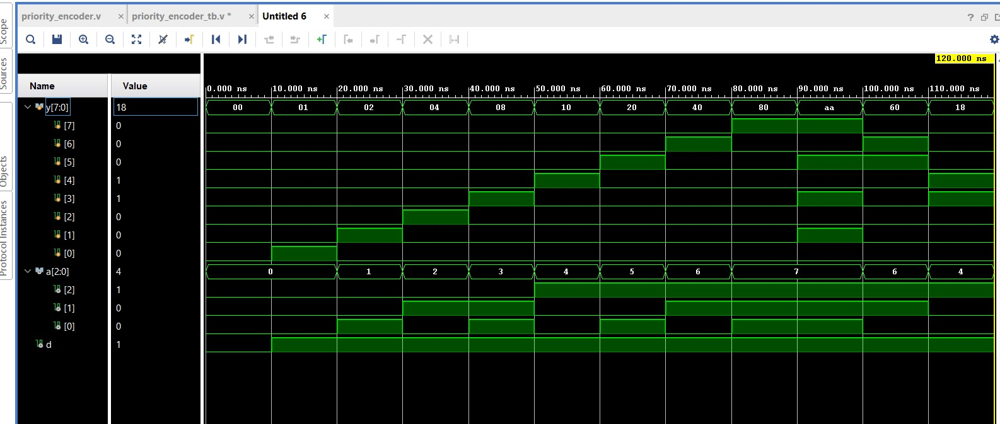
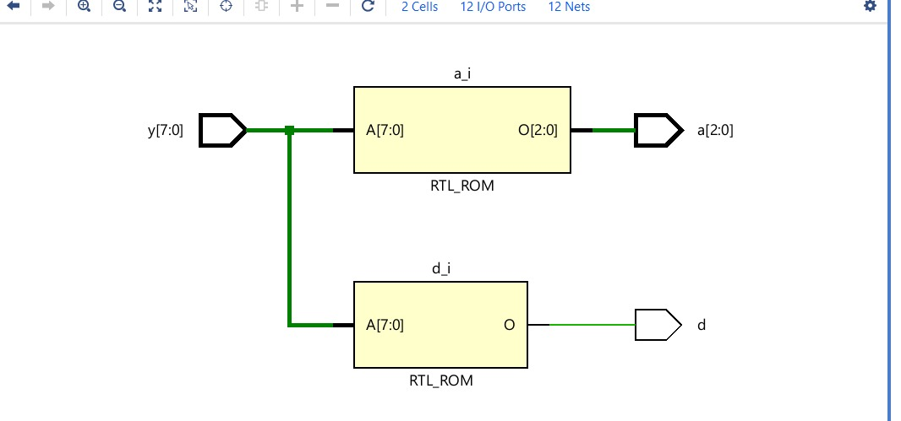

# 🔢 8-to-3 Priority Encoder (Verilog)

## 📌 Overview

This project implements an **8-to-3 Priority Encoder** using Verilog HDL with multiple design styles.

A priority encoder outputs the **binary index of the highest-priority input** that is HIGH.

* Highest Priority → `y7`
* Lowest Priority → `y0`

---

## 📂 Project Navigation (Click to Open)

### 🔧 Design Files

* 👉 [If-Else RTL Design](./8x3_encoder.v)
* 👉 [Loop-Based Optimized Design](./encoder_loop.v)

### 🧪 Verification

* 👉 [Testbench](./encoder_tb.v)

### 📸 Outputs & Diagrams

* 👉 [Simulation Waveform](./encoder_simulation.jpeg)
* 👉 [Schematic Diagram](./encoder_schematic.jpeg)

---

## ⚙️ Functionality

| Input (y[7:0]) | Output (a) | Valid (d) |
| -------------- | ---------- | --------- |
| 00000000       | 000        | 0         |
| 1xxxxxxx       | 111        | 1         |
| 01xxxxxx       | 110        | 1         |
| 001xxxxx       | 101        | 1         |

✔ If multiple inputs are HIGH → highest priority is selected
✔ If all inputs are LOW → output is invalid (`d = 0`)

---

## 🧠 Design Approaches Explained

### 🔹 1. If-Else Method

* Uses **priority chain**
* Simple and easy to understand
* Best for beginners

👉 [View Code](./8x3_encoder.v)

💡 Logic:

* Check from `y7 → y0`
* First HIGH input is selected

---

### 🔹 2. Case-Based Method (`casez`)

* Uses **don't care (`?`) conditions**
* Compact representation
* Must be written carefully to preserve priority

💡 Key Point:

> Order of patterns defines priority

---

### 🔹 3. Loop-Based Method ⭐ (Best)

* Uses **for loop**
* Scalable for larger encoders (16, 32 inputs)
* Industry-preferred approach

👉 [View Code](./encoder_loop.v)

💡 Logic:

* Scan from MSB → LSB
* Stop at first HIGH input

---

## 🧪 Simulation Result

✔ Verifies correct priority selection
✔ Shows valid bit behavior

---

## 🔧 Schematic Diagram

✔ Represents hardware-level implementation

