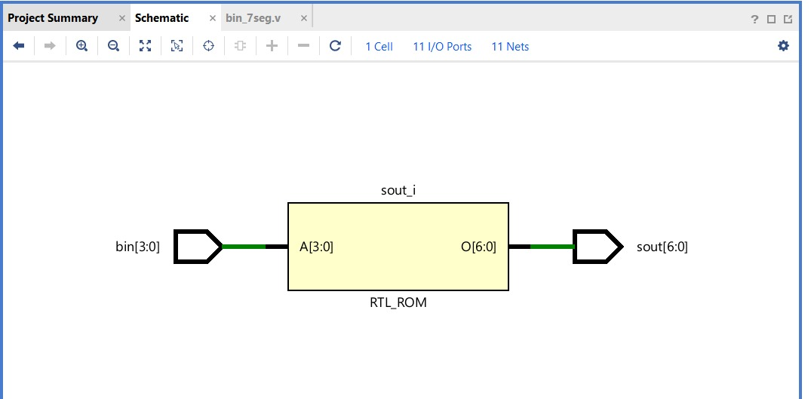

# Binary to 7-Segment Converter (Common Cathode)

## 📖 Description

This project implements a **Binary to 7-Segment Display Converter** using Verilog HDL.

It converts a 4-bit binary input into signals that drive a **7-segment display** to represent decimal digits (0–9).

> 🔧 Display Type: **Common Cathode (Active HIGH)**
> → `1 = ON`, `0 = OFF`

---

## 📥 Input

* `A[3:0]` → 4-bit binary input

---

## 📤 Output

* `a, b, c, d, e, f, g` → 7-segment signals

---

## ⚙️ Segment Representation

```
 a
f b
 g
e c
 d
```

---

## 🔢 Truth Table (Common Cathode)

| Decimal | Input (DCBA) | a b c d e f g |
| ------- | ------------ | ------------- |
| 0       | 0000         | 1 1 1 1 1 1 0 |
| 1       | 0001         | 0 1 1 0 0 0 0 |
| 2       | 0010         | 1 1 0 1 1 0 1 |
| 3       | 0011         | 1 1 1 1 0 0 1 |
| 4       | 0100         | 0 1 1 0 0 1 1 |
| 5       | 0101         | 1 0 1 1 0 1 1 |
| 6       | 0110         | 1 0 1 1 1 1 1 |
| 7       | 0111         | 1 1 1 0 0 0 0 |
| 8       | 1000         | 1 1 1 1 1 1 1 |
| 9       | 1001         | 1 1 1 1 0 1 1 |

---

## 📂 Project Files

* 🔗 [Verilog Code](./bin_to_7seg.v)
* 🔗 [Testbench](./tb.v)
* 🔗 [Report](./report.md)

---

## 📊 Result

* Simulation performed using testbench
* Correct segment outputs verified for digits **0–9**

---

## 🖼️ Outputs

### 🔍 Simulation


### 🔧 Schematic



---

## 🧠 Applications

* Digital clocks
* Calculators
* Embedded display systems

---

## 🔗 Back to Main Repository

* [Main README](../README.md)
