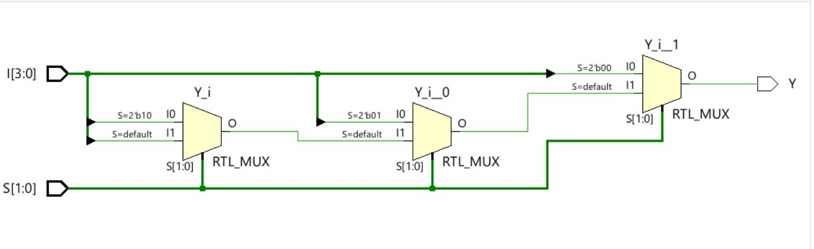

# 4:1 Multiplexer (MUX)

## 📖 Description

This project implements a **4-to-1 Multiplexer** using Verilog HDL.
It selects one of four inputs based on select lines and routes it to the output.

Two modeling approaches are used:

* Behavioral Modeling
* Structural Modeling

---

## 📥 Inputs

* `I[3:0]` → 4 input lines
* `S[1:0]` → Select lines

---

## 📤 Output

* `Y` → Selected output

---

## ⚙️ Working Principle

| S1 S0 | Output |
| ----- | ------ |
| 00    | I0     |
| 01    | I1     |
| 10    | I2     |
| 11    | I3     |

---

## 📂 Project Files

* 🔗 [Behavioral Code](./mux4to1_behavioral.v)
* 🔗 [Structural Code](./structural.v)
* 🔗 [Testbench](./mux_tb.v)
* 🔗 [Report](./report.md)

---

## 📊 Result

* Verified using simulation testbench
* Correct output observed for all select inputs

---

## 🖼️ Outputs

### 🔍 Simulation

### 🔧 Schematic

---

## 🧠 Applications

* Data routing in digital systems
* Communication systems
* CPU design and control logic

---

## 🔗 Back to Main Repository

* [Main README](../../../README.md)

