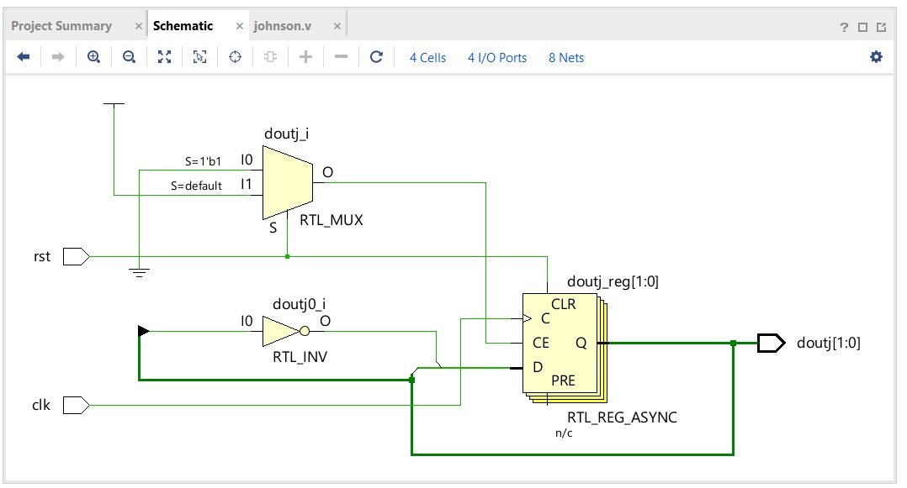

# 2-Bit Johnson Counter

## 📖 Description

This project implements a **2-bit Johnson Counter** using Verilog HDL.

A Johnson counter (also called a **twisted ring counter**) is a shift register where the **inverted output of the last flip-flop is fed back to the first**, creating a unique counting sequence.

---

## 📥 Inputs

* `clk` → Clock signal
* `rst` → Reset signal (active HIGH)

---

## 📤 Output

* `doutj[1:0]` → 2-bit output

---

## ⚙️ Working Principle

* On reset (`rst = 1`), counter initializes to:

  ```
  00
  ```
* On each clock pulse:

  ```
  doutj <= {~doutj[0], doutj[1]};
  ```

---

## 🔄 State Transition

| Clock Cycle | Output |
| ----------- | ------ |
| 0           | 00     |
| 1           | 10     |
| 2           | 11     |
| 3           | 01     |
| 4           | 00     |

👉 Total states = **2 × number of flip-flops = 4**

---

## 📂 Project Files

* 🔗 [Verilog Code](./johnson.v)
* 🔗 [Testbench](./johnson_tb.v)
* 🖼️ [Simulation Output](./johnson_simulation.jpeg)
* 🖼️ [Schematic](./johnson_schematic.jpeg)

---

## 📊 Result

* Correct Johnson sequence verified
* Output cycles through all 4 states
* Reset initializes system correctly

---

## 🖼️ Outputs

### 🔍 Simulation


### 🔧 Schematic



---

## 🧠 Applications

* Sequence generators
* Timing circuits
* Digital pattern generation

---

## 🔗 Navigation

* [⬅ Back to Counters](../README.md)
* [⬅ Back to Main README](../../../README.md)
