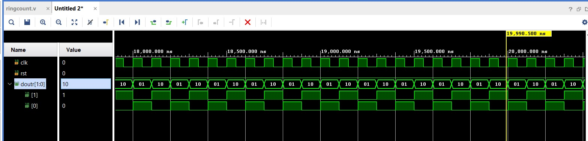
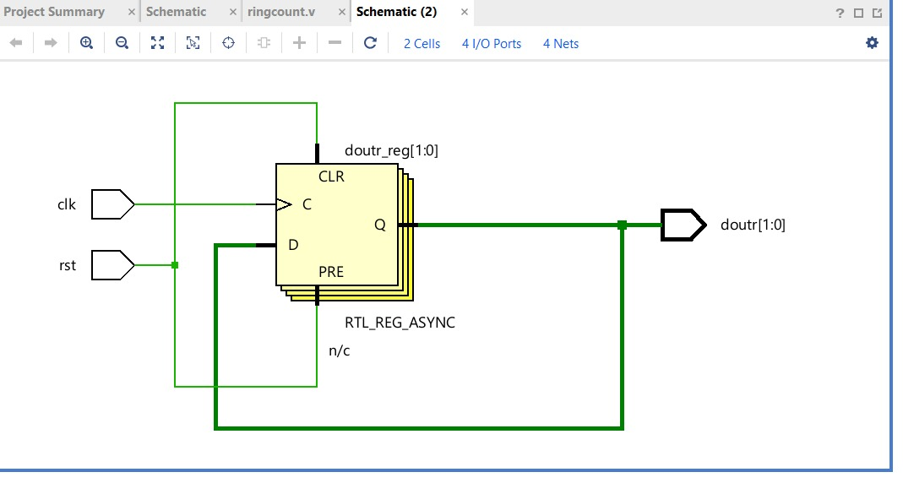

# 2-Bit Ring Counter

## 📖 Description

This project implements a **2-bit Ring Counter** using Verilog HDL.

A ring counter is a type of shift register where the output of the last flip-flop is fed back to the first, creating a **circular shifting pattern**.

---

## 📥 Inputs

* `clk` → Clock signal
* `rst` → Reset signal (active HIGH)

---

## 📤 Output

* `doutr[1:0]` → 2-bit counter output

---

## ⚙️ Working Principle

* On reset (`rst = 1`), the counter initializes to:

  ```
  01
  ```
* On every clock pulse, bits rotate:

  ```
  01 → 10 → 01 → 10 → ...
  ```

---

## 🔄 State Transition

| Clock Cycle | Output |
| ----------- | ------ |
| 0           | 01     |
| 1           | 10     |
| 2           | 01     |
| 3           | 10     |

---

## 📂 Project Files

* 🔗 [Verilog Code](./ring_counter.v)
* 🔗 [Testbench](./ringcount_tb.v)
* 🖼️ [Simulation Output](./ring_simulation.jpeg)
* 🖼️ [Schematic](./ring_schematic.jpeg)

---

## 📊 Result

* Circular shifting verified successfully
* Output alternates between `01` and `10`
* Reset initializes correct starting state

---

## 🖼️ Outputs

### 🔍 Simulation



### 🔧 Schematic



---

## 🧠 Applications

* Sequence generators
* LED chaser circuits
* Control signal generation

---

## 🔗 Navigation

* [⬅ Back to Counters](../README.md)
* [⬅ Back to Main README](../../../README.md)
