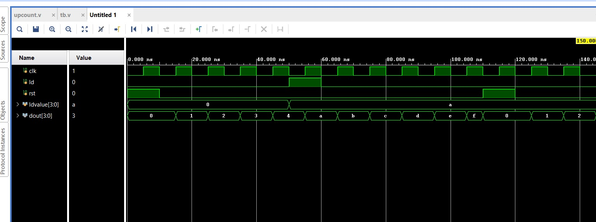
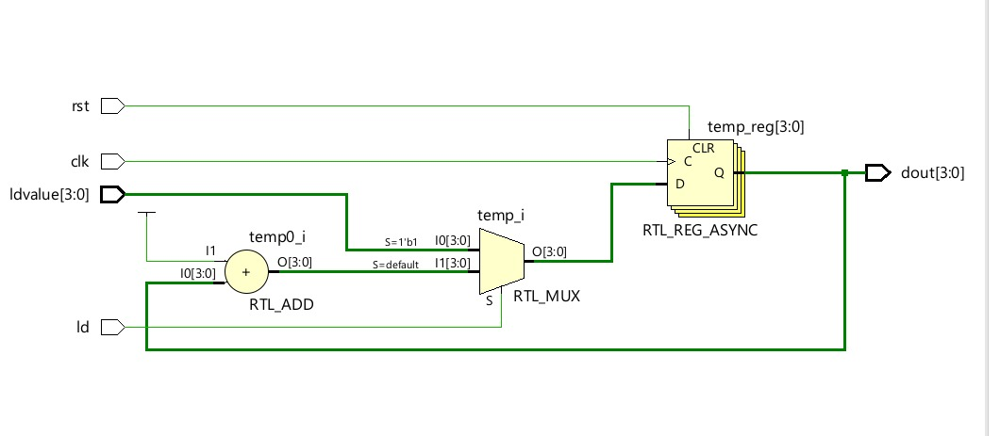

# 4-bit Up Counter (With Load & Reset)

## 📖 Description

This project implements a **4-bit Up Counter** using Verilog HDL.

The counter increments on every clock pulse and supports:

* Asynchronous Reset
* Load operation for custom values

---

## 📥 Inputs

* `clk` → Clock signal
* `rst` → Reset signal
* `ld` → Load enable
* `ldvalue[3:0]` → Value to load

---

## 📤 Output

* `dout[3:0]` → Counter output

---

## ⚙️ Working Principle

* If `rst = 1` → counter resets to `0000`
* Else if `ld = 1` → loads given value
* Else → increments on each clock

---

## 📂 Project Files

* 🔗 [Verilog Code](./up_counter.v)
* 🔗 [Testbench](./tb.v)
* 🖼️ [Simulation Output](./counter_stimulation.jpeg)
* 🖼️ [Schematic](./count_schematic.jpeg)

---

## 📊 Result

* Counter increments correctly
* Load and reset functionality verified

---

## 🖼️ Outputs

### 🔍 Simulation

### 🔧 Schematic

---

## 🧠 Applications

* Digital counters
* Timers
* Frequency division

---

## 🔗 Navigation

* [⬅ Back to Counters](../README.md)
* [⬅ Back to Main README](../../../README.md)

  
