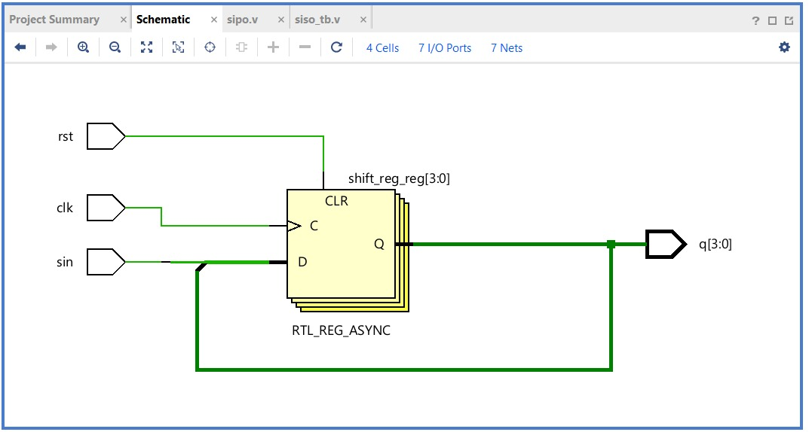
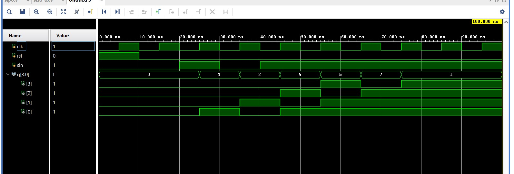

# 🔄 4-bit SIPO Shift Register (Verilog)

## 📌 Problem Statement

Design a **4-bit Serial-In Parallel-Out (SIPO) Shift Register** using Verilog HDL.
The system converts serial input data into parallel output after successive clock cycles.

---

## 🧠 Design Approach

A SIPO shift register consists of **4 D Flip-Flops** connected in series.

* On each clock pulse:

  * Serial input (`din`) enters the first stage
  * Data shifts through flip-flops
* After 4 clock cycles → full 4-bit output is available

---

## 💻 Code Files

👉 **Verilog Design:**
[View SIPO Design](./4BIT_SIPO.v)

👉 **Testbench:**
[View Testbench](./tb.v)

---

## 🧪 Simulation Result

### Input Sequence

```
1 → 0 → 1 → 1
```

### Output Progression

```
Clock 1 → 0001  
Clock 2 → 0010  
Clock 3 → 0101  
Clock 4 → 1011  
```

✔ Verified correct shifting behavior

---

## 🖼️ Visual Proof

### 🔹 RTL Schematic



### 🔹 Simulation Waveform



---

## 🚀 Key Learnings

* Sequential circuit design
* Shift register operation
* Clock-driven data movement
* Testbench-based verification

---

## 🎯 Applications

* Serial-to-parallel data conversion
* Communication systems
* Digital storage

---

## 🏁 Conclusion

This project demonstrates a fundamental sequential circuit and builds a strong base for advanced digital system design.

---
