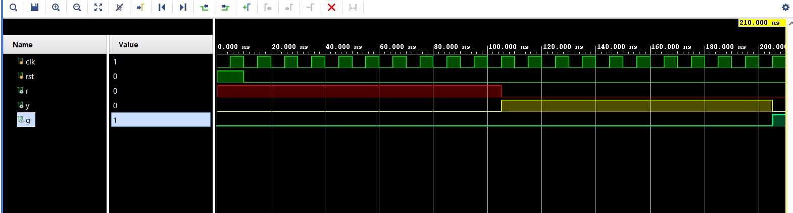

# 🚦 Traffic Light Controller using Verilog (FSM-Based Design)

## 📌 Overview

This project implements a **Traffic Light Controller** using a **Finite State Machine (FSM)** in Verilog HDL.
The design follows **synthesizable hardware practices** by avoiding `#delay` and instead using a **clock-driven counter** for timing control.

---

## 🎯 Objectives

* Design a **3-state traffic light system**
* Implement **FSM-based control logic**
* Use **clock + counter for delay generation**
* Validate functionality using simulation

---

## 🔄 State Transition

```text id="2g9d7r"
RED → YELLOW → GREEN → RED
```

| State  | Output |
| ------ | ------ |
| RED    | r = 1  |
| YELLOW | y = 1  |
| GREEN  | g = 1  |

---

## 🧠 Design Architecture

### 🔹 FSM Modeling

* The controller is implemented using **3 states**:

  * `RED`
  * `YELLOW`
  * `GREEN`
* State transitions depend on:

  * Clock signal
  * Counter value

---

### 🔹 Timing Mechanism

* A **4-bit counter** generates timing delays
* Each state persists for predefined clock cycles:

  * RED → long duration
  * GREEN → long duration
  * YELLOW → shorter duration

---

### 🔹 Code Structure

#### ✔ Sequential Block

* Triggered on `posedge clk`
* Handles:

  * State update
  * Reset condition
  * Counter increment

#### ✔ Combinational Block

* Determines:

  * Next state
  * Output signals (r, y, g)
* Includes **default assignments** to avoid latches

---

## 📂 Project Files

* 🔹 [RTL Design (trafficlight.v)](./trafficlight.v)
* 🔹 [Testbench (tb_trafficlight.v)](./tb_trafficlight.v)
* 🔹 [Simulation Waveform](./trafficlight_simulation.png)

---

## 🧪 Simulation

Simulation performed using **Xilinx Vivado**.

### ✔ Observations:

* Correct FSM transitions observed
* Output sequence verified:

  ```
  RED → YELLOW → GREEN → RED
  ```
* Timing controlled using counter (no `#delay`)

---

## 📸 Waveform Output



---

## ⚙️ Key Features

* ✔ Fully **synthesizable Verilog design**
* ✔ No use of simulation-only delays
* ✔ Proper **FSM implementation (2-process design)**
* ✔ Counter-based timing control
* ✔ Clean and modular structure

---

## 🚀 Future Enhancements

* 🚦 Dual-road traffic controller (North-South / East-West)
* 🚶 Pedestrian crossing integration
* 🚨 Emergency vehicle priority system
* ⏱ Real-time clock-based timing (clock divider)

---

## 🏁 Conclusion

This project demonstrates the implementation of a **real-world digital control system** using FSM and counters.
It emphasizes **hardware-accurate design methodology**, which is essential for FPGA and VLSI applications.

---


---
